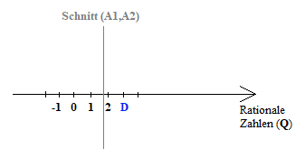

# Die Existenz irrationaler Zahlen
## Vorbemerkung
Die Menge der rationalen Zahlen hat Lücken, eine gewisse Unvollständigkeit oder auch Diskontinuität. Auf einer Geraden gibt es unendlich viele Punkte die keiner rationalen Zahl entsprechen. Schon die alten Griechen wussten, dass die Seite eines Quadrats und seiner Diagonale nicht kommensurabel sind, d.h., man kann sie nicht mit gleichem Maß messen, wie der folgende geometrische Beweis zeigt.

1) Nach pythagoreischer Formel ist $a=\sqrt{2}b$.
2) Der eingezeichnete Kreisbogen teil die Diagonale in zwei Teilstrecken der Länge $b$ und $a-b$.
3) Das kleinere Quadrat mit der Seitenlänge $a-b$ hat eine Diagonal der Länge $\sqrt{2(a-b)^2}=\sqrt{2}(a-b)=\sqrt{2}(\sqrt{2}b-b)=2b-\sqrt{2}b=2b-a$.

Wir behaupten nun $\sqrt{2}=\frac{a}{b}$ ist kommensurabel, und damit eine rationale Zahl. Kommensurabilität bedeutet veranschaulicht:

$\frac{a}{b}=\frac{mc}{nc}=$, $m$ und $n$ ganze Zahlen und wir dürfen annehmen, dass $c$ das kleinste gemeinsame Vielfache ist und somit $b$ minimal.

Konstruktionsschritt 3) zeigt, dass $\sqrt{2}$ auch als $\frac{2b-a}{a-b}$ ausgedrückt werden kann. Das widerspricht jedoch der Annahme, dass $b$ minimal ist, denn $a-b < b$. Es gibt also kein kleinstes Maß $c$ für $\sqrt{2}$. Somit ist $\sqrt{2}$ nicht kommensurabel also keine rationale Zahl.

Als Ergänzung geben wir hier noch einen algebraischen Beweis für diese Tatsache an. Wieder behaupten wir, dass $\sqrt{2}$ eine Bruchzahl $\frac{a}{b}$ ist und nicht weiter gekürzt werden kann.
$$\sqrt{2}=\frac{a}{b}$$
$$2=\frac{a^2}{b^2}$$
$$2a^2=b^2$$ $a^2$ ist gerade und somit auch $a$ gerade. $a$ dürfen wir daher fortan als $2k$ schreiben.
$$2b^2=(2k)^2=4k^2$$ $2b^2$ ist damit ein Vielfaches von 4 und daher q ebenfalls gerade.

Das steht im Widerspruch zur Aussage vom Anfang, dass $\frac{a}{b}$ nicht weiter kürzbar ist. Wir haben also gezeigt, dass $\sqrt{2}$ nicht als Bruch dargestellt werden kann und damit auch keine rationale Zahl ist.

## Motivation

Die Arithmetik soll aus sich selbst heraus entwickelt werden. So lassen sich die Rechengesetze für negative und rationale Zahlen auf die Gesetze der positiven ganzen Zahlen zurückführen. Die irrationalen Zahlen müssen folglich einzig und alleine mit Hilfe der Rechengesetze für die rationalen Zahlen definiert werden. Aber wie? Hierzu muss die Frage beantwortet werden was man unter Kontinuität versteht.

Essenz von Kontinuität: Wenn alle Punkte einer Geraden in zwei Klassen fallen, sodass jeder Punkt der ersten Klasse sich auf der linken Seite befindet von jedem Punkt aus der zweiten Klasse, dann existiert ein und genau ein Punkt, der diese Unterteilung erzeugt.

## Dedekind Schnitt

Ein Dedekind Schnitt wird angegeben mit $(A_1,A_2)$ mit $A_1, A_2$ unendlich große Mengen rationaler Zahlen, wobei jede Zahl $a_1$ in $A_1$ kleiner ist als jede Zahl $a_2$ in $A_2$. Es gibt genau ein Zahl $\alpha$ die zu einem Schnitt (cut) führt. Dieses $\alpha$ unterteilt dann die Menge der rationalen Zahlen in die zwei Klassen $A_1$ und $A_2$. Ist $\alpha$ eine rationale Zahl, so ist es entweder die größte Zahl von $A_1$ oder die kleinste Zahl von $A_2$.

$(A_1,A_2)$

**Gleichung 1**
$$\lambda^2 < D < (\lambda + 1)^2$$

**Gleichung 2**
$$d=\frac{t}{u}$$

$$du=t$$

$$t-du=0$$

$$t^2-d^2u^2=0$$

$$t^2-Du^2=0$$

Wir dürfen annehmen $u$ ist kleinste positive Ganzzahl die diese Gleichung erfüllt.

**Gleichung 3-1**
$$\lambda^2 < \frac{t^2}{u^2} < (\lambda + 1)^2$$

$$\lambda u < t < (\lambda + 1)u$$

$$0 < t - \lambda u < u$$

$$u^{'} = t - \lambda u$$

Man bemerke $u^{'} < u$.

**Gleichung 3-2**

$$\lambda < \frac{t}{u} < (\lambda + 1)$$

$$\lambda tu < t^2 < (\lambda + 1) tu$$

$$\frac{\lambda t}{u} < \frac{t^2}{u^2} = D < \frac{(\lambda + 1) t}{u}$$

$$0 < Du - \lambda t < t$$

$$t^{'} = Du - \lambda t$$

Man bemerke $t^{'} < t$.

**Gleichung 4**
$$t^{'2} - Du^{'2} = (Du - \lambda t)^2 - D(t - \lambda u)^2 = D(Du^2 - t^2) + \lambda^2(t^2 - Du^2) = (\lambda^2 - D)(t^2-Du^2)=0$$

$$D=\frac{t^{2}}{u^{2}}$$

$$D=\frac{t^{'2}}{u^{'2}}$$

